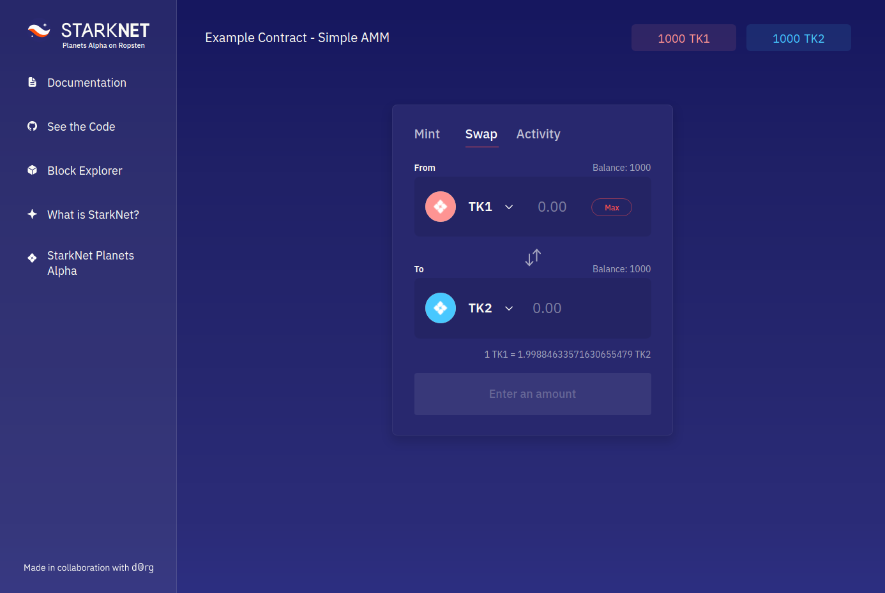

# Starknet AMM Demo

Automated Market Maker demo running on Starknet.

Part of [StarkNet Planets Demo - Alpha on Ropsten](https://starkware.medium.com/starknet-planets-alpha-on-ropsten-e7494929cb95)

## Prequisites

Node v14.x

## Installation

- `git clone git@github.com:dOrgTech/starkware-demo.git`
- `cd starkware-demo`
- `yarn`
- Create a `.env` file at root level and ask one of the maintainers for the required API keys and URLs
- `yarn dev`

## Contributors

Starkware & dOrg.
